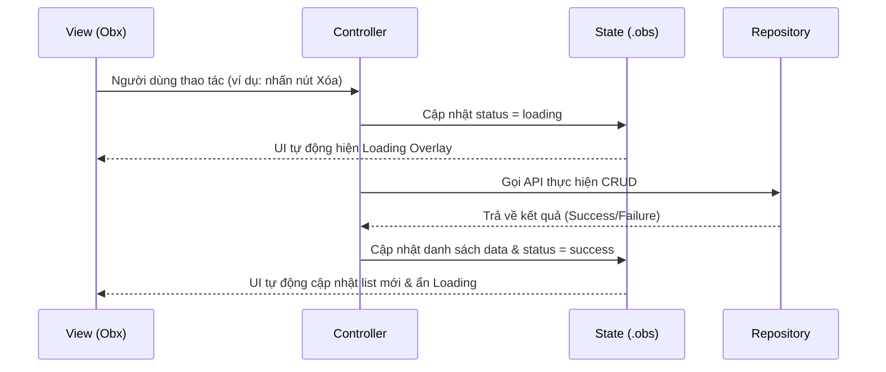

# Go Fresher - Product Management System

Dự án Flutter quản lý sản phẩm (CRUD) sử dụng GetX với kiến trúc phân lớp hiện đại, đảm bảo tính reactive và dễ bảo trì.

## 🏗 Kiến trúc Project (GetX Pattern)

Dự án áp dụng mô hình **State - Controller - Binding** để tách biệt hoàn toàn giữa giao diện, logic nghiệp vụ và quản lý trạng thái.

- **View (UI)**: Sử dụng `GetView` và `Obx` để hiển thị giao diện. Chỉ rebuild những widget thực sự thay đổi dữ liệu.
- **Controller (Logic)**: Kế thừa `GetxController`, nơi xử lý logic nghiệp vụ, gọi API và cập nhật State.
- **State (Dữ liệu)**: Một lớp riêng biệt chứa các biến `.obs`. Giúp Controller sạch sẽ và tập trung vào logic.
- **Binding (DI)**: Quản lý Dependency Injection, khởi tạo và hủy Controller theo vòng đời của màn hình.
- **Navigator**: Lớp trung gian bọc các lệnh điều hướng của GetX, giúp code UI không phụ thuộc trực tiếp vào logic chuyển màn hình.

---

## 🔄 State Management Flow

Dưới đây là quy trình xử lý dữ liệu reactive trong ứng dụng:



---

## ⚖️ Phân tích kiến trúc (Trade-offs)

Việc sử dụng GetX với mô hình **State-Controller-Binding** mang lại sự cân bằng giữa tốc độ phát triển và khả năng mở rộng của dự án:

### ✅ Ưu điểm (Pros)
1. **Giảm độ phức tạp (Low Complexity)**: GetX tối giản hóa việc kết nối giữa Logic và UI. Không cần sử dụng các hàm trung gian phức tạp để truyền dữ liệu, giúp code tường minh và dễ tiếp cận cho người mới.
2. **Năng suất cao (Productivity)**: Cơ chế Reactive (`.obs`) giúp lập trình viên tập trung vào xử lý dữ liệu thay vì quản lý vòng đời render. Việc tích hợp sẵn Navigation và Dependency Injection giúp giảm thời gian setup cấu trúc dự án.
3. **Hiệu năng Re-build (Fine-grained Control)**: `Obx` chỉ re-build những widget thực sự đọc giá trị thay đổi. Điều này cực kỳ quan trọng trong các màn hình danh sách lớn hoặc form nhập liệu phức tạp.
4. **Quản lý bộ nhớ (Smart Memory Management)**: Thông qua `Bindings`, GetX tự động hủy các Controller khi không còn sử dụng, ngăn chặn tình trạng rò rỉ bộ nhớ (Memory Leak) mà không cần can thiệp thủ công nhiều.

### ⚠️ Thách thức (Considerations)
1. **Kỷ luật tổ chức code**: Do GetX rất linh hoạt, nếu không tuân thủ nghiêm ngặt mô hình tách biệt **State** và **Controller** như dự án này, mã nguồn rất dễ trở nên khó kiểm soát (Spaghetti code) khi dự án phình to.
2. **Khả năng Test (Testability)**: Mặc dù logic nghiệp vụ trong Controller rất dễ viết Unit Test, nhưng việc kiểm thử các thành phần phụ thuộc vào `Get.find` hoặc `Navigation` yêu cầu thiết lập môi trường Mock (`Get.testMode`) một cách cẩn thận để đảm bảo tính độc lập của test case.
3. **Phụ thuộc vào Thư viện**: Việc sử dụng quá nhiều tính năng "all-in-one" của GetX khiến dự án phụ thuộc chặt chẽ vào hệ sinh thái này.

---

## 🚀 Cách chạy dự án

1. **Cài đặt dependencies**:
   ```bash
   flutter pub get
   ```

2. **Chạy Unit Test**:
   ```bash
   flutter test test/unit/
   ```

3. **Chạy ứng dụng**:
   ```bash
   flutter run
   ```
